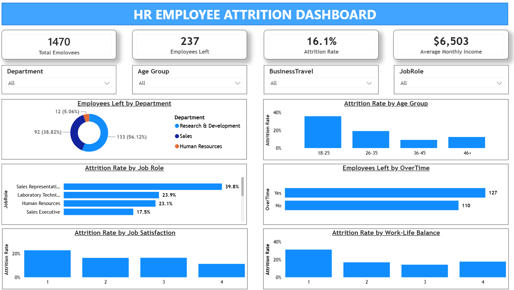
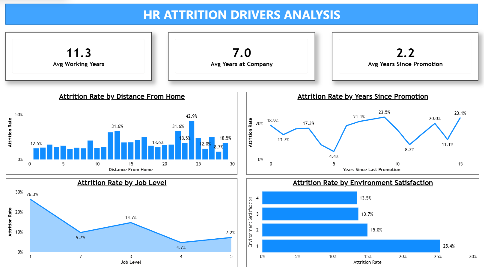

# Executive HR Attrition & Retention Analytics Dashboard


---

### Dashboard Link: [[https://app.powerbi.com/view?r=eyJrIjoiMTVjZDc4OTYtMWI2MS00ZjczLTkzOTctZWMwNjg4NmZmNDEwIiwidCI6IjJhYTJkZTVkLTllNTktNDhlOS04NzU1LTA3YzRiYWExNmEyMiJ9](https://app.powerbi.com/view?r=eyJrIjoiZGI0ZjExN2YtYTZjNS00MTVjLWJiMzgtMTZhZjgzZTA4ZmM4IiwidCI6IjJhYTJkZTVkLTllNTktNDhlOS04NzU1LTA3YzRiYWExNmEyMiJ9)]

---

## 📌 Project Overview

An executive-level, interactive two-page **Power BI** dashboard engineered to analyze workforce turnover drivers, quantify attrition risks, and evaluate retention metrics. Utilizing custom DAX calculations and clean executive UI/UX design standards, this project transforms HR employee data into interactive insights for analyzing workforce attrition patterns.

---

## 🎯 Objectives

* **Analyze Attrition Patterns:** Track macro workforce metrics (Total Employees, Attrition Rate, Avg Income).
* **Identify Attrition Drivers:** Evaluate key turnover levers such as overtime, commute distance, and salary levels.
* **Analyze Stagnation:** Uncover career progression bottlenecks using tenure and promotion metrics.
* **Deliver Executive UI:** Design a high-contrast, structured 2-page dashboard tailored for HR decision-makers.

---

## 📸 Dashboard Structure & Preview

### Page 1: HR Employee Attrition Overview
Focuses on macro-level workforce KPIs, departmental breakdowns, demographic segmentation, and satisfaction metrics.
* **Top KPIs:** Total Employees, Employees Left, Attrition Rate (%), Average Monthly Income.
* **Interactive Slicers:** Department, Age Group, Business Travel, Job Role.
* **Visual Breakdown:**
  * **Employees Left by Department** *(Donut Chart)*
  * **Attrition Rate by Age Group** *(Clustered Column Chart)*
  * **Attrition Rate by Job Role** *(Clustered Bar Chart)*
  * **Employees Left by OverTime** *(Clustered Bar Chart)*
  * **Attrition Rate by Job Satisfaction** *(Clustered Column Chart)*
  * **Attrition Rate by Work-Life Balance** *(Clustered Column Chart)*



---

### Page 2: HR Attrition Drivers Analysis
Focuses on analysis of attrition patterns related to career growth, commute burden, compensation progression, and workplace environment.
* **Top KPIs:** Avg Working Years (`11.3`), Avg Years at Company (`7.0`), Avg Years Since Promotion (`2.2`).
* **Visual Breakdown:**
  * **Attrition Rate by Distance From Home** *(Clustered Column Chart)* — Highlights commute burdens (>15 km).
  * **Attrition Rate by Years Since Promotion** *(Line Chart)* — Tracks turnover spikes from career stagnation.
  * **Attrition Rate by Job Level** *(Area Chart)* — Examines retention improvement through progression.
  * **Attrition Rate by Environment Satisfaction** *(Clustered Bar Chart)* — Measures workplace culture risk factors.



---

## 🛠️ Data Model & Core DAX Measures

**Dataset:** IBM HR Analytics Employee Attrition & Performance (`WA_Fn-UseC_-HR-Employee-Attrition.csv`)
* **Total Records:** 1,470 Employees | 35 Attributes
* **Target Variable:** `Attrition` (`Yes` / `No`)

### Custom DAX Measures

```dax
// 1. Total Employees Count
Total Employees = COUNTROWS('HR-Employee-Attrition')

// 2. Total Employees Attritted
Employees Left =
CALCULATE(
    COUNTROWS('HR-Employee-Attrition'),
    'HR-Employee-Attrition'[Attrition] = "Yes"
)

// 3. Overall Attrition Rate (%)
Attrition Rate = DIVIDE([Employees Left], [Total Employees], 0)

// 4. Average Monthly Income
Average Monthly Income = AVERAGE('HR-Employee-Attrition'[MonthlyIncome])

// 5. Tenure & Career KPIs
Avg Working Years = AVERAGE('HR-Employee-Attrition'[TotalWorkingYears])
Avg Years at Company = AVERAGE('HR-Employee-Attrition'[YearsAtCompany])
Avg Years Since Promo = AVERAGE('HR-Employee-Attrition'[YearsSinceLastPromotion])
```

---

## 🎨 UI/UX & Design Architecture Standards

To maintain an executive presentation standard across both canvas pages:

* **Visual Hierarchy:** Soft drop shadows (8 px rounded corners) applied exclusively to KPI cards and visual containers.
* **Slicer Navigation:** Flat-styled dropdown slicers with zero drop shadows for clean header separation.
* **Data Label Standardization:** Outside End data labels enabled across all bar, column, line, and area visuals for instant readability.
* **Typography & Palette:** Center-aligned, bold visual titles matching dark navy (`#1B365D`) text styling over structured headers.
* **Layout Structure:** Strict 2x2 grid layout per page to eliminate visual clutter and ensure effortless scannability.

---

## 💡 Key Business Insights

* **OverTime Association:** Employees working overtime show a higher attrition rate compared with non-overtime employees.
* **Commute Sensitivity:** Employees living farther than **15 km** from the workplace show a sharp rise in turnover rates.
* **Career Progression:** Attrition rates vary across employees based on years since their last promotion.
* **Job Level Retention:** Entry-level employees (Job Level 1) display the highest attrition rate, which decreases progressively as employees advance to higher job levels.

---

## 📁 Repository Structure

```text
HR-Attrition-Analytics/
│
├── data/
│   └── WA_Fn-UseC_-HR-Employee-Attrition.csv
│
├── dashboard/
│   └── HR_Attrition_Dashboard.pbix
│
├── screenshots/
│   ├── Page1_Overview.png
│   └── Page2_DeepDive.png
│
└── README.md
```

---

## 🚀 How to Run & Explore

1. **Clone the repository:**
   ```bash
   git clone [https://github.com/tyagi-4080/HR-Attrition-Analytics.git](https://github.com/tyagi-4080/HR-Attrition-Analytics.git)
   cd HR-Attrition-Analytics
   ```

2. **Open the Dashboard:**
   * Download the dataset inside `/data`.
   * Launch `HR_Attrition_Dashboard.pbix` using **Power BI Desktop** (August 2023 release or newer).
   * Refresh data connections if prompted.
